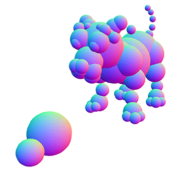

# .BHD and .BHT



The arrangement in space of the balls that make up a pet or baby is determined by animations, and these animations
are stored as resources within the `Resources\Dogz 5 Rez.dll` library (and `Catz 5 Rez.dll` etc). They may be extracted using [Resource Hacker](http://www.angusj.com/resourcehacker/).

### BHD

This is a Directory which provides an index for all of the animations that are available.

See `animation-decoder.js` for the details. 
 
It begins with a header that specifies the number of balls in this species, their sizes, then the number of animations
that are available.

This is followed by a list of animation lengths in frames. Finally, for each animation frame a byte-offset for the start
of that frame within its corresponding BHT file is listed.

### BHT

A BHT file stores one animation for the species. The file begins with a file header, typically 84 bytes, which is then followed
by a series of frames. For each frame a header is recorded with the x,y,z bounds of the balls in that frame and an unknown
tag field, then for each ball in the skeleton, the (x,y,z) position of that ball is recorded, along with two other 
per-ball fields that I didn't discover the meaning of.

## Live Demo

For a live demo which views 3D animations, in this folder run these commands to build the required JavaScript:

```bash
npm install
npm start
```

Then open the "index.html" file in your browser. Or you can view it pre-built on the web instead on this page:

https://thenickdude.github.io/petz-file-formats/animations/index.html